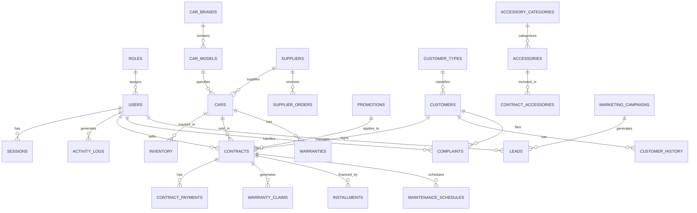

# Phân Tích Thiết Kế Database

**Phần Mềm Quản Lý Đại Lý Xe Hơi**

---

## Mục Lục

1. [Tổng Quan](#1-tổng-quan)
2. [Danh Sách Bảng](#2-danh-sách-bảng)
3. [Chi Tiết Từng Bảng](#3-chi-tiết-từng-bảng)
4. [Mối Quan Hệ](#4-mối-quan-hệ)
5. [ER Diagram](#5-er-diagram)
6. [Indexes & Optimization](#6-indexes--optimization)

---

## 1. Tổng Quan

### 1.1 Thông Tin Chung

| Thuộc tính | Giá trị |
|------------|---------|
| **Database** | SQLite3 |
| **File** | `data/car_management.db` |
| **Encoding** | UTF-8 |
| **Foreign Keys** | Enabled |
| **Tổng số bảng** | 28 bảng |
| **Cấp độ CSDL** | 3NF (Third Normal Form) |

### 1.2 Quy Ước Đặt Tên

- **Bảng**: Danh từ số nhiều, snake_case (vd: `cars`, `customers`)
- **Cột**: snake_case, tiếng Anh (vd: `full_name`, `created_at`)
- **Khóa chính**: `id` (INTEGER, AUTOINCREMENT)
- **Khóa ngoại**: `[table_name]_id` (vd: `car_id`, `customer_id`)
- **Timestamp**: `created_at`, `updated_at` (DATETIME, DEFAULT CURRENT_TIMESTAMP)
- **Soft Delete**: `is_deleted` (BOOLEAN, DEFAULT 0), `deleted_at` (DATETIME)

---

## 2. Danh Sách Bảng

### Theo Module

| Module | Số bảng | Các bảng |
|--------|---------|----------|
| **0. Foundation** | 4 | `users`, `roles`, `permissions`, `user_roles` |
| **1. Car Management** | 4 | `cars`, `car_models`, `car_brands`, `car_images` |
| **2. Customer Management** | 3 | `customers`, `customer_types`, `customer_history` |
| **3. Contract Management** | 3 | `contracts`, `contract_accessories`, `contract_payments` |
| **4. Inventory** | 3 | `inventory`, `stock_movements`, `stock_alerts` |
| **5. Warranty** | 3 | `warranties`, `warranty_claims`, `warranty_services` |
| **6. Promotion** | 3 | `promotions`, `promotion_rules`, `promotion_applications` |
| **7. Accessory** | 3 | `accessories`, `accessory_categories`, `accessory_combos` |
| **8. Supplier** | 3 | `suppliers`, `supplier_orders`, `supplier_evaluations` |
| **9. Installment** | 2 | `installments`, `installment_payments` |
| **10. After-sales** | 2 | `maintenance_schedules`, `service_requests` |
| **11. Marketing** | 2 | `marketing_campaigns`, `leads` |
| **12. Complaint** | 2 | `complaints`, `complaint_assignments` |
| **13. Security** | 3 | `activity_logs`, `sessions`, `login_attempts` |
| **14. Reporting** | 1 | `report_templates` |

---

## 3. Chi Tiết Từng Bảng

### MODULE 0: FOUNDATION (Employee & Auth)

#### `users` - Nhân viên & Tài khoản

```sql
CREATE TABLE users (
    id INTEGER PRIMARY KEY AUTOINCREMENT,
    username VARCHAR(50) UNIQUE NOT NULL,
    password_hash VARCHAR(255) NOT NULL,
    full_name VARCHAR(100) NOT NULL,
    email VARCHAR(100) UNIQUE,
    phone VARCHAR(20),
    avatar_path VARCHAR(255),
    role_id INTEGER,
    department VARCHAR(50),
    position VARCHAR(50),
    hire_date DATE,
    base_salary DECIMAL(15,2),
    status VARCHAR(20) DEFAULT 'active', -- active, inactive, suspended
    last_login DATETIME,
    login_count INTEGER DEFAULT 0,
    created_at DATETIME DEFAULT CURRENT_TIMESTAMP,
    updated_at DATETIME DEFAULT CURRENT_TIMESTAMP,
    is_deleted BOOLEAN DEFAULT 0,
    deleted_at DATETIME,
    FOREIGN KEY (role_id) REFERENCES roles(id)
);
```

| Cột | Kiểu | Mô tả |
|-----|------|-------|
| `id` | INTEGER PK | ID tự tăng |
| `username` | VARCHAR(50) | Tên đăng nhập (unique) |
| `password_hash` | VARCHAR(255) | Mật khẩu đã mã hóa (bcrypt) |
| `full_name` | VARCHAR(100) | Họ tên đầy đủ |
| `email` | VARCHAR(100) | Email (unique) |
| `phone` | VARCHAR(20) | Số điện thoại |
| `role_id` | INTEGER FK | Phân quyền |
| `department` | VARCHAR(50) | Phòng ban |
| `position` | VARCHAR(50) | Chức vụ |
| `hire_date` | DATE | Ngày vào làm |
| `base_salary` | DECIMAL(15,2) | Lương cơ bản |
| `status` | VARCHAR(20) | Trạng thái tài khoản |

#### `roles` - Vai trò

```sql
CREATE TABLE roles (
    id INTEGER PRIMARY KEY AUTOINCREMENT,
    role_name VARCHAR(50) UNIQUE NOT NULL,
    role_code VARCHAR(30) UNIQUE NOT NULL, -- admin, manager, sales, accountant
    description TEXT,
    level INTEGER DEFAULT 1, -- 1: admin, 2: manager, 3: sales, 4: accountant
    created_at DATETIME DEFAULT CURRENT_TIMESTAMP
);
```

#### `permissions` - Quyền hạn

```sql
CREATE TABLE permissions (
    id INTEGER PRIMARY KEY AUTOINCREMENT,
    permission_name VARCHAR(100) NOT NULL,
    permission_code VARCHAR(50) UNIQUE NOT NULL, -- car.view, car.create, car.edit
    module VARCHAR(50), -- cars, customers, contracts, ...
    action VARCHAR(20), -- view, create, edit, delete, approve
    description TEXT,
    created_at DATETIME DEFAULT CURRENT_TIMESTAMP
);
```

#### `role_permissions` - Gán quyền cho vai trò

```sql
CREATE TABLE role_permissions (
    id INTEGER PRIMARY KEY AUTOINCREMENT,
    role_id INTEGER NOT NULL,
    permission_id INTEGER NOT NULL,
    created_at DATETIME DEFAULT CURRENT_TIMESTAMP,
    FOREIGN KEY (role_id) REFERENCES roles(id) ON DELETE CASCADE,
    FOREIGN KEY (permission_id) REFERENCES permissions(id) ON DELETE CASCADE,
    UNIQUE(role_id, permission_id)
);
```

---

### MODULE 1: CAR MANAGEMENT

#### `car_brands` - Hãng xe

```sql
CREATE TABLE car_brands (
    id INTEGER PRIMARY KEY AUTOINCREMENT,
    brand_name VARCHAR(50) UNIQUE NOT NULL,
    brand_code VARCHAR(20) UNIQUE NOT NULL, -- toyota, honda, mercedes
    country VARCHAR(50),
    logo_path VARCHAR(255),
    website VARCHAR(100),
    description TEXT,
    is_active BOOLEAN DEFAULT 1,
    created_at DATETIME DEFAULT CURRENT_TIMESTAMP
);
```

#### `car_models` - Dòng xe

```sql
CREATE TABLE car_models (
    id INTEGER PRIMARY KEY AUTOINCREMENT,
    brand_id INTEGER NOT NULL,
    model_name VARCHAR(50) NOT NULL,
    model_code VARCHAR(30) NOT NULL, -- camry, civic, c-class
    segment VARCHAR(20), -- A, B, C, D, SUV, MPV
    body_type VARCHAR(20), -- sedan, hatchback, suv, pickup
    seat_capacity INTEGER,
    fuel_type VARCHAR(20), -- gasoline, diesel, hybrid, electric
    transmission VARCHAR(20), -- manual, automatic, cvt
    launch_year INTEGER,
    is_active BOOLEAN DEFAULT 1,
    created_at DATETIME DEFAULT CURRENT_TIMESTAMP,
    FOREIGN KEY (brand_id) REFERENCES car_brands(id)
);
```

#### `cars` - Thông tin xe

```sql
CREATE TABLE cars (
    id INTEGER PRIMARY KEY AUTOINCREMENT,
    vin VARCHAR(17) UNIQUE, -- Vehicle Identification Number
    license_plate VARCHAR(20) UNIQUE,
    model_id INTEGER NOT NULL,
    year INTEGER,
    color VARCHAR(30),
    color_code VARCHAR(10), -- Mã màu nội bộ
    interior_color VARCHAR(30),
    mileage INTEGER DEFAULT 0,
    engine_number VARCHAR(50),
    chassis_number VARCHAR(50),
    
    -- Giá
    cost_price DECIMAL(15,2) NOT NULL, -- Giá nhập
    selling_price DECIMAL(15,2) NOT NULL, -- Giá bán đề xuất
    market_price DECIMAL(15,2), -- Giá thị trường
    
    -- Tồn kho
    status VARCHAR(20) DEFAULT 'available', -- available, reserved, sold, maintenance
    warehouse_location VARCHAR(50), -- Vị trí trong kho
    import_date DATE,
    estimated_arrival DATE, -- Ngày dự kiến về (cho xe order)
    
    -- Nguồn gốc
    supplier_id INTEGER,
    import_batch_code VARCHAR(50), -- Mã đợt nhập hàng
    
    -- Thông tin bảo hành
    warranty_months INTEGER DEFAULT 36,
    warranty_km INTEGER DEFAULT 100000,
    
    -- Mô tả & Ghi chú
    description TEXT,
    notes TEXT,
    
    -- Metadata
    created_by INTEGER,
    updated_by INTEGER,
    created_at DATETIME DEFAULT CURRENT_TIMESTAMP,
    updated_at DATETIME DEFAULT CURRENT_TIMESTAMP,
    is_deleted BOOLEAN DEFAULT 0,
    deleted_at DATETIME,
    
    FOREIGN KEY (model_id) REFERENCES car_models(id),
    FOREIGN KEY (supplier_id) REFERENCES suppliers(id),
    FOREIGN KEY (created_by) REFERENCES users(id),
    FOREIGN KEY (updated_by) REFERENCES users(id)
);
```

| Cột | Kiểu | Mô tả |
|-----|------|-------|
| `vin` | VARCHAR(17) | Số khung (Vehicle ID) |
| `license_plate` | VARCHAR(20) | Biển số xe |
| `cost_price` | DECIMAL(15,2) | Giá nhập từ NCC |
| `selling_price` | DECIMAL(15,2) | Giá bán đề xuất |
| `status` | VARCHAR(20) | Trạng thái: available/reserved/sold/maintenance |
| `warranty_months` | INTEGER | Thời hạn bảo hành (tháng) |
| `warranty_km` | INTEGER | Bảo hành đến km |

#### `car_images` - Hình ảnh xe

```sql
CREATE TABLE car_images (
    id INTEGER PRIMARY KEY AUTOINCREMENT,
    car_id INTEGER NOT NULL,
    image_path VARCHAR(255) NOT NULL,
    image_type VARCHAR(20), -- exterior, interior, engine, detail
    is_primary BOOLEAN DEFAULT 0, -- Ảnh chính
    display_order INTEGER DEFAULT 0,
    created_at DATETIME DEFAULT CURRENT_TIMESTAMP,
    FOREIGN KEY (car_id) REFERENCES cars(id) ON DELETE CASCADE
);
```

---

### MODULE 2: CUSTOMER MANAGEMENT

#### `customer_types` - Loại khách hàng

```sql
CREATE TABLE customer_types (
    id INTEGER PRIMARY KEY AUTOINCREMENT,
    type_name VARCHAR(50) NOT NULL, -- Cá nhân, Doanh nghiệp
    type_code VARCHAR(20) NOT NULL, -- individual, corporate
    description TEXT,
    discount_percent DECIMAL(5,2) DEFAULT 0,
    created_at DATETIME DEFAULT CURRENT_TIMESTAMP
);
```

#### `customers` - Khách hàng

```sql
CREATE TABLE customers (
    id INTEGER PRIMARY KEY AUTOINCREMENT,
    
    -- Thông tin cơ bản
    customer_type_id INTEGER NOT NULL,
    full_name VARCHAR(100) NOT NULL,
    id_card VARCHAR(20), -- CMND/CCCD
    tax_code VARCHAR(20), -- Mã số thuế (doanh nghiệp)
    company_name VARCHAR(100), -- Tên công ty
    
    -- Liên hệ
    phone VARCHAR(20) NOT NULL,
    email VARCHAR(100),
    address VARCHAR(200),
    city VARCHAR(50),
    district VARCHAR(50),
    ward VARCHAR(50),
    
    -- Thông tin cá nhân
    birth_date DATE,
    gender VARCHAR(10), -- male, female, other
    occupation VARCHAR(50),
    
    -- Phân loại VIP
    vip_status VARCHAR(20) DEFAULT 'regular', -- potential, regular, silver, gold, platinum
    vip_since DATE, -- Ngày trở thành VIP
    total_purchases INTEGER DEFAULT 0, -- Tổng số lần mua
    total_spent DECIMAL(15,2) DEFAULT 0, -- Tổng giá trị đã mua
    
    -- Nguồn khách hàng
    source VARCHAR(50), -- walk-in, referral, website, facebook, event
    referred_by INTEGER, -- Người giới thiệu (customer_id)
    
    -- Ghi chú
    notes TEXT,
    preferences TEXT, -- Sở thích, yêu cầu đặc biệt (JSON)
    
    -- Metadata
    assigned_to INTEGER, -- Nhân viên phụ trách
    created_by INTEGER,
    created_at DATETIME DEFAULT CURRENT_TIMESTAMP,
    updated_at DATETIME DEFAULT CURRENT_TIMESTAMP,
    is_deleted BOOLEAN DEFAULT 0,
    
    FOREIGN KEY (customer_type_id) REFERENCES customer_types(id),
    FOREIGN KEY (referred_by) REFERENCES customers(id),
    FOREIGN KEY (assigned_to) REFERENCES users(id),
    FOREIGN KEY (created_by) REFERENCES users(id)
);
```

| Cột | Kiểu | Mô tả |
|-----|------|-------|
| `vip_status` | VARCHAR(20) | Phân loại: potential/regular/silver/gold/platinum |
| `total_purchases` | INTEGER | Tổng số xe đã mua |
| `total_spent` | DECIMAL(15,2) | Tổng giá trị giao dịch |
| `assigned_to` | INTEGER FK | Nhân viên phụ trách |
| `source` | VARCHAR(50) | Nguồn: walk-in/referral/website/facebook/event |

#### `customer_history` - Lịch sử tương tác

```sql
CREATE TABLE customer_history (
    id INTEGER PRIMARY KEY AUTOINCREMENT,
    customer_id INTEGER NOT NULL,
    interaction_type VARCHAR(30), -- visit, call, email, test_drive, purchase, complaint
    interaction_date DATETIME DEFAULT CURRENT_TIMESTAMP,
    description TEXT,
    result TEXT, -- Kết quả tương tác
    follow_up_date DATE, -- Ngày cần follow-up
    created_by INTEGER,
    created_at DATETIME DEFAULT CURRENT_TIMESTAMP,
    FOREIGN KEY (customer_id) REFERENCES customers(id) ON DELETE CASCADE,
    FOREIGN KEY (created_by) REFERENCES users(id)
);
```

---

### MODULE 3: CONTRACT MANAGEMENT

#### `contracts` - Hợp đồng bán xe

```sql
CREATE TABLE contracts (
    id INTEGER PRIMARY KEY AUTOINCREMENT,
    
    -- Mã hợp đồng
    contract_code VARCHAR(20) UNIQUE NOT NULL, -- HD20240001
    
    -- Thông tin giao dịch
    car_id INTEGER NOT NULL,
    customer_id INTEGER NOT NULL,
    sales_by INTEGER NOT NULL, -- Nhân viên bán hàng
    
    -- Giá trị hợp đồng
    car_price DECIMAL(15,2) NOT NULL, -- Giá xe
    accessory_total DECIMAL(15,2) DEFAULT 0, -- Tổng phụ kiện
    subtotal DECIMAL(15,2) NOT NULL, -- Tạm tính
    discount_amount DECIMAL(15,2) DEFAULT 0, -- Giảm giá KM
    discount_percent DECIMAL(5,2) DEFAULT 0,
    vat_amount DECIMAL(15,2) DEFAULT 0, -- Thuế VAT (nếu có)
    registration_fee DECIMAL(15,2) DEFAULT 0, -- Phí đăng ký
    insurance_fee DECIMAL(15,2) DEFAULT 0, -- Bảo hiểm
    other_fees DECIMAL(15,2) DEFAULT 0,
    total_amount DECIMAL(15,2) NOT NULL, -- Tổng thanh toán
    
    -- Thanh toán
    payment_method VARCHAR(20), -- cash, transfer, installment
    down_payment DECIMAL(15,2) DEFAULT 0, -- Tiền đặt cọc
    paid_amount DECIMAL(15,2) DEFAULT 0, -- Đã thanh toán
    remaining_amount DECIMAL(15,2), -- Còn lại
    
    -- Trạng thái
    status VARCHAR(20) DEFAULT 'draft', -- draft, confirmed, deposit_paid, fully_paid, delivered, cancelled
    
    -- Thời gian
    contract_date DATE NOT NULL,
    expected_delivery DATE, -- Ngày dự kiến giao
    actual_delivery DATE, -- Ngày thực giao
    
    -- Khuyến mãi
    promotion_id INTEGER,
    promotion_details TEXT, -- JSON lưu chi tiết KM áp dụng
    
    -- Ghi chú
    notes TEXT,
    cancellation_reason TEXT, -- Lý do hủy (nếu có)
    
    -- Metadata
    created_by INTEGER,
    updated_by INTEGER,
    created_at DATETIME DEFAULT CURRENT_TIMESTAMP,
    updated_at DATETIME DEFAULT CURRENT_TIMESTAMP,
    is_deleted BOOLEAN DEFAULT 0,
    
    FOREIGN KEY (car_id) REFERENCES cars(id),
    FOREIGN KEY (customer_id) REFERENCES customers(id),
    FOREIGN KEY (sales_by) REFERENCES users(id),
    FOREIGN KEY (promotion_id) REFERENCES promotions(id),
    FOREIGN KEY (created_by) REFERENCES users(id),
    FOREIGN KEY (updated_by) REFERENCES users(id)
);
```

| Trạng thái | Mô tả |
|------------|-------|
| `draft` | Mới tạo, chưa xác nhận |
| `confirmed` | Đã xác nhận, chờ đặt cọc |
| `deposit_paid` | Đã đặt cọc |
| `fully_paid` | Đã thanh toán đủ |
| `delivered` | Đã giao xe |
| `cancelled` | Đã hủy |

#### `contract_accessories` - Phụ kiện trong hợp đồng

```sql
CREATE TABLE contract_accessories (
    id INTEGER PRIMARY KEY AUTOINCREMENT,
    contract_id INTEGER NOT NULL,
    accessory_id INTEGER NOT NULL,
    quantity INTEGER DEFAULT 1,
    unit_price DECIMAL(12,2) NOT NULL,
    total_price DECIMAL(12,2) NOT NULL,
    installation_fee DECIMAL(12,2) DEFAULT 0,
    notes TEXT,
    created_at DATETIME DEFAULT CURRENT_TIMESTAMP,
    FOREIGN KEY (contract_id) REFERENCES contracts(id) ON DELETE CASCADE,
    FOREIGN KEY (accessory_id) REFERENCES accessories(id)
);
```

#### `contract_payments` - Lịch sử thanh toán

```sql
CREATE TABLE contract_payments (
    id INTEGER PRIMARY KEY AUTOINCREMENT,
    contract_id INTEGER NOT NULL,
    payment_date DATE NOT NULL,
    amount DECIMAL(15,2) NOT NULL,
    payment_method VARCHAR(20), -- cash, transfer, credit_card, cheque
    transaction_code VARCHAR(50), -- Mã giao dịch ngân hàng
    received_by INTEGER, -- Nhân viên thu tiền
    notes TEXT,
    receipt_number VARCHAR(20), -- Số biên lai
    created_at DATETIME DEFAULT CURRENT_TIMESTAMP,
    FOREIGN KEY (contract_id) REFERENCES contracts(id) ON DELETE CASCADE,
    FOREIGN KEY (received_by) REFERENCES users(id)
);
```

---

### MODULE 4: INVENTORY MANAGEMENT

#### `inventory` - Tồn kho hiện tại

```sql
CREATE TABLE inventory (
    id INTEGER PRIMARY KEY AUTOINCREMENT,
    car_id INTEGER UNIQUE NOT NULL,
    quantity INTEGER DEFAULT 1,
    location VARCHAR(50), -- Vị trí trong kho
    status VARCHAR(20) DEFAULT 'available', -- available, reserved, damaged
    last_stock_check DATE, -- Ngày kiểm kê gần nhất
    notes TEXT,
    updated_at DATETIME DEFAULT CURRENT_TIMESTAMP,
    FOREIGN KEY (car_id) REFERENCES cars(id)
);
```

#### `stock_movements` - Lịch sử xuất nhập kho

```sql
CREATE TABLE stock_movements (
    id INTEGER PRIMARY KEY AUTOINCREMENT,
    car_id INTEGER NOT NULL,
    movement_type VARCHAR(20), -- import, export, transfer, adjustment
    quantity INTEGER NOT NULL,
    reference_type VARCHAR(30), -- purchase_order, contract, return, adjustment
    reference_id INTEGER, -- ID của đơn hàng/hợp đồng liên quan
    from_location VARCHAR(50),
    to_location VARCHAR(50),
    reason TEXT,
    performed_by INTEGER,
    movement_date DATETIME DEFAULT CURRENT_TIMESTAMP,
    FOREIGN KEY (car_id) REFERENCES cars(id),
    FOREIGN KEY (performed_by) REFERENCES users(id)
);
```

#### `stock_alerts` - Cảnh báo tồn kho

```sql
CREATE TABLE stock_alerts (
    id INTEGER PRIMARY KEY AUTOINCREMENT,
    model_id INTEGER NOT NULL,
    min_threshold INTEGER DEFAULT 1,
    max_threshold INTEGER DEFAULT 10,
    current_quantity INTEGER DEFAULT 0,
    alert_level VARCHAR(10), -- low, high, normal
    is_active BOOLEAN DEFAULT 1,
    last_alert_date DATETIME,
    created_at DATETIME DEFAULT CURRENT_TIMESTAMP,
    FOREIGN KEY (model_id) REFERENCES car_models(id)
);
```

---

### MODULE 5: WARRANTY MANAGEMENT

#### `warranties` - Thông tin bảo hành

```sql
CREATE TABLE warranties (
    id INTEGER PRIMARY KEY AUTOINCREMENT,
    contract_id INTEGER NOT NULL,
    car_id INTEGER NOT NULL,
    customer_id INTEGER NOT NULL,
    
    -- Thời hạn bảo hành
    warranty_start DATE NOT NULL,
    warranty_end DATE NOT NULL,
    warranty_months INTEGER NOT NULL,
    warranty_km INTEGER,
    
    -- Phạm vi bảo hành
    coverage_type VARCHAR(30), -- full, powertrain, corrosion, roadside
    coverage_details TEXT, -- JSON chi tiết
    
    -- Trạng thái
    status VARCHAR(20) DEFAULT 'active', -- active, expired, voided
    
    -- Thông tin bổ sung
    extended_warranty BOOLEAN DEFAULT 0,
    extended_months INTEGER DEFAULT 0,
    notes TEXT,
    
    created_at DATETIME DEFAULT CURRENT_TIMESTAMP,
    FOREIGN KEY (contract_id) REFERENCES contracts(id),
    FOREIGN KEY (car_id) REFERENCES cars(id),
    FOREIGN KEY (customer_id) REFERENCES customers(id)
);
```

#### `warranty_claims` - Yêu cầu bảo hành

```sql
CREATE TABLE warranty_claims (
    id INTEGER PRIMARY KEY AUTOINCREMENT,
    warranty_id INTEGER NOT NULL,
    claim_code VARCHAR(20) UNIQUE NOT NULL,
    
    -- Thông tin sửa chữa
    claim_date DATE NOT NULL,
    issue_description TEXT NOT NULL,
    current_mileage INTEGER,
    
    -- Phân loại
    claim_type VARCHAR(20), -- warranty, paid_repair
    is_warranty_covered BOOLEAN, -- Có thuộc bảo hành không
    
    -- Chi phí
    labor_cost DECIMAL(12,2) DEFAULT 0,
    parts_cost DECIMAL(12,2) DEFAULT 0,
    total_cost DECIMAL(12,2) DEFAULT 0,
    customer_cost DECIMAL(12,2) DEFAULT 0, -- Chi phí KH phải trả (nếu không bảo hành)
    
    -- Trạng thái
    status VARCHAR(20) DEFAULT 'pending', -- pending, approved, in_progress, completed, rejected
    
    -- Thông tin xử lý
    approved_by INTEGER,
    approved_at DATETIME,
    completed_at DATETIME,
    notes TEXT,
    
    created_by INTEGER,
    created_at DATETIME DEFAULT CURRENT_TIMESTAMP,
    
    FOREIGN KEY (warranty_id) REFERENCES warranties(id),
    FOREIGN KEY (approved_by) REFERENCES users(id),
    FOREIGN KEY (created_by) REFERENCES users(id)
);
```

#### `warranty_services` - Chi tiết dịch vụ bảo hành

```sql
CREATE TABLE warranty_services (
    id INTEGER PRIMARY KEY AUTOINCREMENT,
    claim_id INTEGER NOT NULL,
    service_type VARCHAR(50), -- repair, replacement, inspection
    description TEXT,
    parts_replaced TEXT, -- JSON danh sách phụ tùng
    labor_hours DECIMAL(5,2),
    service_date DATE,
    performed_by INTEGER,
    notes TEXT,
    FOREIGN KEY (claim_id) REFERENCES warranty_claims(id),
    FOREIGN KEY (performed_by) REFERENCES users(id)
);
```

---

### MODULE 6: PROMOTION MANAGEMENT

#### `promotions` - Chương trình khuyến mãi

```sql
CREATE TABLE promotions (
    id INTEGER PRIMARY KEY AUTOINCREMENT,
    
    -- Thông tin cơ bản
    promotion_code VARCHAR(20) UNIQUE NOT NULL,
    promotion_name VARCHAR(100) NOT NULL,
    description TEXT,
    
    -- Loại khuyến mãi
    promotion_type VARCHAR(30), -- discount_amount, discount_percent, gift_accessory, interest_reduction, combo
    
    -- Giá trị
    discount_amount DECIMAL(12,2),
    discount_percent DECIMAL(5,2),
    max_discount DECIMAL(12,2), -- Giảm tối đa (cho %)
    
    -- Thời gian
    start_date DATE NOT NULL,
    end_date DATE NOT NULL,
    
    -- Phạm vi áp dụng
    apply_to VARCHAR(20), -- all, brand, model, specific_cars, inventory_long
    target_brand_id INTEGER,
    target_model_id INTEGER,
    min_inventory_days INTEGER, -- Số ngày tồn kho tối thiểu (cho inventory_long)
    
    -- Điều kiện
    min_car_price DECIMAL(15,2),
    max_car_price DECIMAL(15,2),
    max_applications INTEGER, -- Số lượng áp dụng tối đa
    current_applications INTEGER DEFAULT 0,
    
    -- Trạng thái
    status VARCHAR(20) DEFAULT 'active', -- active, paused, ended, scheduled
    
    -- Metadata
    created_by INTEGER,
    created_at DATETIME DEFAULT CURRENT_TIMESTAMP,
    updated_at DATETIME DEFAULT CURRENT_TIMESTAMP,
    
    FOREIGN KEY (target_brand_id) REFERENCES car_brands(id),
    FOREIGN KEY (target_model_id) REFERENCES car_models(id),
    FOREIGN KEY (created_by) REFERENCES users(id)
);
```

#### `promotion_applications` - Lịch sử áp dụng KM

```sql
CREATE TABLE promotion_applications (
    id INTEGER PRIMARY KEY AUTOINCREMENT,
    promotion_id INTEGER NOT NULL,
    contract_id INTEGER NOT NULL,
    applied_discount DECIMAL(12,2) NOT NULL,
    applied_at DATETIME DEFAULT CURRENT_TIMESTAMP,
    applied_by INTEGER,
    FOREIGN KEY (promotion_id) REFERENCES promotions(id),
    FOREIGN KEY (contract_id) REFERENCES contracts(id),
    FOREIGN KEY (applied_by) REFERENCES users(id)
);
```

---

### MODULE 7: ACCESSORY MANAGEMENT

#### `accessory_categories` - Danh mục phụ kiện

```sql
CREATE TABLE accessory_categories (
    id INTEGER PRIMARY KEY AUTOINCREMENT,
    category_name VARCHAR(50) NOT NULL, -- Nội thất, Ngoại thất, Điện tử, Bảo vệ, Trang trí
    category_code VARCHAR(20) NOT NULL,
    description TEXT,
    is_active BOOLEAN DEFAULT 1,
    created_at DATETIME DEFAULT CURRENT_TIMESTAMP
);
```

#### `accessories` - Phụ kiện

```sql
CREATE TABLE accessories (
    id INTEGER PRIMARY KEY AUTOINCREMENT,
    
    -- Thông tin cơ bản
    accessory_code VARCHAR(20) UNIQUE NOT NULL,
    accessory_name VARCHAR(100) NOT NULL,
    category_id INTEGER NOT NULL,
    
    -- Giá
    cost_price DECIMAL(12,2) NOT NULL,
    selling_price DECIMAL(12,2) NOT NULL,
    
    -- Tồn kho
    stock_quantity INTEGER DEFAULT 0,
    min_stock_alert INTEGER DEFAULT 5,
    
    -- Mô tả
    description TEXT,
    specifications TEXT, -- JSON thông số kỹ thuật
    image_path VARCHAR(255),
    
    -- Trạng thái
    is_active BOOLEAN DEFAULT 1,
    
    -- Metadata
    created_at DATETIME DEFAULT CURRENT_TIMESTAMP,
    updated_at DATETIME DEFAULT CURRENT_TIMESTAMP,
    
    FOREIGN KEY (category_id) REFERENCES accessory_categories(id)
);
```

#### `accessory_combos` - Gói phụ kiện combo

```sql
CREATE TABLE accessory_combos (
    id INTEGER PRIMARY KEY AUTOINCREMENT,
    combo_code VARCHAR(20) UNIQUE NOT NULL,
    combo_name VARCHAR(100) NOT NULL,
    description TEXT,
    
    -- Giá
    original_total DECIMAL(12,2), -- Tổng giá gốc
    combo_price DECIMAL(12,2) NOT NULL, -- Giá combo ưu đãi
    savings_amount DECIMAL(12,2), -- Tiết kiệm
    
    -- Thời gian
    start_date DATE,
    end_date DATE,
    is_active BOOLEAN DEFAULT 1,
    
    created_at DATETIME DEFAULT CURRENT_TIMESTAMP
);
```

#### `combo_items` - Chi tiết combo

```sql
CREATE TABLE combo_items (
    id INTEGER PRIMARY KEY AUTOINCREMENT,
    combo_id INTEGER NOT NULL,
    accessory_id INTEGER NOT NULL,
    quantity INTEGER DEFAULT 1,
    FOREIGN KEY (combo_id) REFERENCES accessory_combos(id) ON DELETE CASCADE,
    FOREIGN KEY (accessory_id) REFERENCES accessories(id)
);
```

---

### MODULE 8: SUPPLIER MANAGEMENT

#### `suppliers` - Nhà cung cấp

```sql
CREATE TABLE suppliers (
    id INTEGER PRIMARY KEY AUTOINCREMENT,
    
    -- Thông tin cơ bản
    supplier_code VARCHAR(20) UNIQUE NOT NULL,
    company_name VARCHAR(100) NOT NULL,
    tax_code VARCHAR(20),
    
    -- Liên hệ
    contact_person VARCHAR(100),
    phone VARCHAR(20),
    email VARCHAR(100),
    address VARCHAR(200),
    website VARCHAR(100),
    
    -- Phân loại
    supply_type VARCHAR(30), -- cars, accessories, both
    
    -- Đánh giá
    rating DECIMAL(2,1) DEFAULT 5.0, -- 1.0 - 5.0
    quality_score INTEGER, -- 1-10
    delivery_score INTEGER,
    price_score INTEGER,
    
    -- Hợp đồng
    partnership_date DATE,
    contract_expiry DATE,
    payment_terms VARCHAR(50), -- 30_days, 60_days, etc.
    
    -- Trạng thái
    status VARCHAR(20) DEFAULT 'active',
    
    notes TEXT,
    created_at DATETIME DEFAULT CURRENT_TIMESTAMP,
    updated_at DATETIME DEFAULT CURRENT_TIMESTAMP
);
```

#### `supplier_orders` - Đơn đặt hàng từ NCC

```sql
CREATE TABLE supplier_orders (
    id INTEGER PRIMARY KEY AUTOINCREMENT,
    
    order_code VARCHAR(20) UNIQUE NOT NULL,
    supplier_id INTEGER NOT NULL,
    
    -- Thông tin đơn hàng
    order_type VARCHAR(20), -- cars, accessories
    order_date DATE NOT NULL,
    expected_delivery DATE,
    actual_delivery DATE,
    
    -- Giá trị
    subtotal DECIMAL(15,2) NOT NULL,
    discount DECIMAL(12,2) DEFAULT 0,
    tax_amount DECIMAL(12,2) DEFAULT 0,
    total_amount DECIMAL(15,2) NOT NULL,
    
    -- Thanh toán
    paid_amount DECIMAL(15,2) DEFAULT 0,
    payment_status VARCHAR(20) DEFAULT 'pending', -- pending, partial, paid
    
    -- Trạng thái
    status VARCHAR(20) DEFAULT 'draft', -- draft, sent, confirmed, shipping, received, cancelled
    
    notes TEXT,
    created_by INTEGER,
    created_at DATETIME DEFAULT CURRENT_TIMESTAMP,
    
    FOREIGN KEY (supplier_id) REFERENCES suppliers(id),
    FOREIGN KEY (created_by) REFERENCES users(id)
);
```

#### `supplier_order_items` - Chi tiết đơn hàng

```sql
CREATE TABLE supplier_order_items (
    id INTEGER PRIMARY KEY AUTOINCREMENT,
    order_id INTEGER NOT NULL,
    item_type VARCHAR(20), -- car, accessory
    item_id INTEGER, -- car_id hoặc accessory_id
    quantity INTEGER NOT NULL,
    unit_price DECIMAL(12,2) NOT NULL,
    total_price DECIMAL(12,2) NOT NULL,
    notes TEXT,
    FOREIGN KEY (order_id) REFERENCES supplier_orders(id) ON DELETE CASCADE
);
```

---

### MODULE 9: INSTALLMENT MANAGEMENT

#### `installments` - Thông tin trả góp

```sql
CREATE TABLE installments (
    id INTEGER PRIMARY KEY AUTOINCREMENT,
    
    contract_id INTEGER NOT NULL,
    
    -- Ngân hàng/Tài chính
    finance_company VARCHAR(100) NOT NULL, -- Ngân hàng cho vay
    finance_contact VARCHAR(100),
    
    -- Thông tin khoản vay
    loan_amount DECIMAL(15,2) NOT NULL, -- Số tiền vay
    interest_rate DECIMAL(5,2) NOT NULL, -- Lãi suất %/năm
    loan_term_months INTEGER NOT NULL, -- Thời hạn (tháng)
    
    -- Tính toán
    monthly_payment DECIMAL(12,2) NOT NULL, -- Tiền trả hàng tháng
    total_interest DECIMAL(15,2), -- Tổng lãi phải trả
    total_amount DECIMAL(15,2), -- Tổng gốc + lãi
    
    -- Theo dõi
    payments_made INTEGER DEFAULT 0, -- Số kỳ đã trả
    remaining_payments INTEGER, -- Số kỳ còn lại
    paid_principal DECIMAL(15,2) DEFAULT 0, -- Gốc đã trả
    paid_interest DECIMAL(15,2) DEFAULT 0, -- Lãi đã trả
    remaining_balance DECIMAL(15,2), -- Dư nợ còn lại
    
    -- Trạng thái
    status VARCHAR(20) DEFAULT 'active', -- active, completed, defaulted, early_settlement
    
    start_date DATE,
    end_date DATE,
    
    notes TEXT,
    created_at DATETIME DEFAULT CURRENT_TIMESTAMP,
    
    FOREIGN KEY (contract_id) REFERENCES contracts(id)
);
```

#### `installment_payments` - Lịch sử trả góp

```sql
CREATE TABLE installment_payments (
    id INTEGER PRIMARY KEY AUTOINCREMENT,
    installment_id INTEGER NOT NULL,
    
    payment_number INTEGER NOT NULL, -- Kỳ thứ mấy
    due_date DATE NOT NULL, -- Ngày đến hạn
    payment_date DATE, -- Ngày thực trả
    
    -- Chi tiết
    principal_amount DECIMAL(12,2) NOT NULL, -- Tiền gốc
    interest_amount DECIMAL(12,2) NOT NULL, -- Tiền lãi
    total_amount DECIMAL(12,2) NOT NULL,
    paid_amount DECIMAL(12,2),
    
    -- Trạng thái
    status VARCHAR(20) DEFAULT 'pending', -- pending, paid, late, missed
    days_late INTEGER DEFAULT 0,
    late_fee DECIMAL(12,2) DEFAULT 0,
    
    notes TEXT,
    created_at DATETIME DEFAULT CURRENT_TIMESTAMP,
    
    FOREIGN KEY (installment_id) REFERENCES installments(id)
);
```

---

### MODULE 10: AFTER-SALES SERVICES

#### `maintenance_schedules` - Lịch bảo dưỡng

```sql
CREATE TABLE maintenance_schedules (
    id INTEGER PRIMARY KEY AUTOINCREMENT,
    
    contract_id INTEGER NOT NULL,
    car_id INTEGER NOT NULL,
    customer_id INTEGER NOT NULL,
    
    -- Lịch bảo dưỡng
    service_type VARCHAR(50), -- 1000km, 5000km, 10000km, etc.
    service_km INTEGER, -- Theo km
    service_months INTEGER, -- Hoặc theo tháng
    
    -- Thời gian
    scheduled_date DATE,
    reminder_sent BOOLEAN DEFAULT 0,
    reminder_date DATE,
    
    -- Kết quả
    actual_date DATE,
    actual_km INTEGER,
    status VARCHAR(20) DEFAULT 'scheduled', -- scheduled, completed, skipped, overdue
    
    -- Chi phí
    service_cost DECIMAL(12,2),
    notes TEXT,
    
    FOREIGN KEY (contract_id) REFERENCES contracts(id),
    FOREIGN KEY (car_id) REFERENCES cars(id),
    FOREIGN KEY (customer_id) REFERENCES customers(id)
);
```

#### `service_requests` - Yêu cầu dịch vụ (cứu hộ, sửa chữa)

```sql
CREATE TABLE service_requests (
    id INTEGER PRIMARY KEY AUTOINCREMENT,
    
    request_code VARCHAR(20) UNIQUE NOT NULL,
    customer_id INTEGER NOT NULL,
    car_id INTEGER,
    
    -- Loại dịch vụ
    service_type VARCHAR(30), -- rescue, repair, consultation, part_order
    priority VARCHAR(10) DEFAULT 'normal', -- low, normal, high, urgent
    
    -- Thông tin yêu cầu
    request_date DATETIME DEFAULT CURRENT_TIMESTAMP,
    description TEXT NOT NULL,
    location VARCHAR(200), -- Vị trí (cho cứu hộ)
    
    -- Phân công
    assigned_to INTEGER,
    
    -- Xử lý
    response_time INTEGER, -- Thời gian phản hồi (phút)
    resolution_time INTEGER, -- Thời gian xử lý (phút)
    
    -- Chi phí
    estimated_cost DECIMAL(12,2),
    actual_cost DECIMAL(12,2),
    
    -- Trạng thái
    status VARCHAR(20) DEFAULT 'open', -- open, assigned, in_progress, resolved, closed
    
    -- Đánh giá
    customer_rating INTEGER, -- 1-5
    customer_feedback TEXT,
    
    notes TEXT,
    created_at DATETIME DEFAULT CURRENT_TIMESTAMP,
    completed_at DATETIME,
    
    FOREIGN KEY (customer_id) REFERENCES customers(id),
    FOREIGN KEY (car_id) REFERENCES cars(id),
    FOREIGN KEY (assigned_to) REFERENCES users(id)
);
```

---

### MODULE 11: MARKETING MANAGEMENT

#### `marketing_campaigns` - Chiến dịch marketing

```sql
CREATE TABLE marketing_campaigns (
    id INTEGER PRIMARY KEY AUTOINCREMENT,
    
    campaign_code VARCHAR(20) UNIQUE NOT NULL,
    campaign_name VARCHAR(100) NOT NULL,
    description TEXT,
    
    -- Thời gian
    start_date DATE NOT NULL,
    end_date DATE NOT NULL,
    
    -- Ngân sách
    budget DECIMAL(15,2) NOT NULL,
    spent_amount DECIMAL(15,2) DEFAULT 0,
    
    -- Kênh
    channels TEXT, -- JSON: ["facebook", "google", "event"]
    
    -- Mục tiêu
    target_leads INTEGER,
    target_conversions INTEGER,
    
    -- Kết quả
    actual_leads INTEGER DEFAULT 0,
    actual_conversions INTEGER DEFAULT 0,
    revenue_generated DECIMAL(15,2) DEFAULT 0,
    
    -- Trạng thái
    status VARCHAR(20) DEFAULT 'planned', -- planned, active, paused, completed, cancelled
    
    -- Người phụ trách
    managed_by INTEGER,
    
    notes TEXT,
    created_at DATETIME DEFAULT CURRENT_TIMESTAMP,
    
    FOREIGN KEY (managed_by) REFERENCES users(id)
);
```

#### `leads` - Khách hàng tiềm năng

```sql
CREATE TABLE leads (
    id INTEGER PRIMARY KEY AUTOINCREMENT,
    
    -- Thông tin
    full_name VARCHAR(100) NOT NULL,
    phone VARCHAR(20),
    email VARCHAR(100),
    address VARCHAR(200),
    
    -- Nguồn
    source VARCHAR(50), -- facebook, google, website, referral, event
    campaign_id INTEGER,
    source_details VARCHAR(100), -- Chi tiết nguồn
    
    -- Nhu cầu
    interested_brand_id INTEGER,
    interested_model_id INTEGER,
    budget_range VARCHAR(50),
    expected_purchase_date DATE,
    notes TEXT,
    
    -- Phân công & Theo dõi
    assigned_to INTEGER,
    status VARCHAR(20) DEFAULT 'new', -- new, contacted, qualified, proposal, converted, lost
    
    -- Ngày liên hệ
    first_contact_date DATE,
    last_contact_date DATE,
    next_follow_up DATE,
    
    -- Chuyển đổi
    converted_to_customer_id INTEGER,
    converted_at DATETIME,
    
    created_at DATETIME DEFAULT CURRENT_TIMESTAMP,
    
    FOREIGN KEY (interested_brand_id) REFERENCES car_brands(id),
    FOREIGN KEY (interested_model_id) REFERENCES car_models(id),
    FOREIGN KEY (campaign_id) REFERENCES marketing_campaigns(id),
    FOREIGN KEY (assigned_to) REFERENCES users(id),
    FOREIGN KEY (converted_to_customer_id) REFERENCES customers(id)
);
```

---

### MODULE 12: COMPLAINT MANAGEMENT

#### `complaints` - Khiếu nại

```sql
CREATE TABLE complaints (
    id INTEGER PRIMARY KEY AUTOINCREMENT,
    
    complaint_code VARCHAR(20) UNIQUE NOT NULL,
    customer_id INTEGER NOT NULL,
    contract_id INTEGER,
    
    -- Thông tin khiếu nại
    complaint_date DATETIME DEFAULT CURRENT_TIMESTAMP,
    category VARCHAR(50), -- service, product, price, staff, other
    severity VARCHAR(10), -- low, medium, high, critical
    title VARCHAR(200) NOT NULL,
    description TEXT NOT NULL,
    
    -- Bằng chứng
    evidence_files TEXT, -- JSON paths
    
    -- Xử lý
    assigned_to INTEGER,
    handled_by INTEGER,
    
    -- Trạng thái
    status VARCHAR(20) DEFAULT 'open', -- open, investigating, resolved, closed, escalated
    
    -- Giải quyết
    resolution TEXT,
    resolution_date DATETIME,
    compensation_amount DECIMAL(12,2),
    
    -- Đánh giá
    customer_satisfaction INTEGER, -- 1-5
    would_recommend BOOLEAN,
    
    created_by INTEGER,
    created_at DATETIME DEFAULT CURRENT_TIMESTAMP,
    updated_at DATETIME DEFAULT CURRENT_TIMESTAMP,
    
    FOREIGN KEY (customer_id) REFERENCES customers(id),
    FOREIGN KEY (contract_id) REFERENCES contracts(id),
    FOREIGN KEY (assigned_to) REFERENCES users(id),
    FOREIGN KEY (handled_by) REFERENCES users(id),
    FOREIGN KEY (created_by) REFERENCES users(id)
);
```

---

### MODULE 13: SECURITY & AUDIT

#### `activity_logs` - Nhật ký hoạt động

```sql
CREATE TABLE activity_logs (
    id INTEGER PRIMARY KEY AUTOINCREMENT,
    
    user_id INTEGER,
    action VARCHAR(50) NOT NULL, -- create, update, delete, login, logout, export
    module VARCHAR(50), -- cars, customers, contracts, etc.
    table_name VARCHAR(50),
    record_id INTEGER,
    
    -- Chi tiết
    old_values TEXT, -- JSON
    new_values TEXT, -- JSON
    description TEXT,
    
    -- IP & Thiết bị
    ip_address VARCHAR(45),
    user_agent TEXT,
    
    created_at DATETIME DEFAULT CURRENT_TIMESTAMP,
    
    FOREIGN KEY (user_id) REFERENCES users(id)
);
```

#### `sessions` - Quản lý phiên đăng nhập

```sql
CREATE TABLE sessions (
    id INTEGER PRIMARY KEY AUTOINCREMENT,
    
    user_id INTEGER NOT NULL,
    session_token VARCHAR(255) UNIQUE NOT NULL,
    
    -- Thời gian
    started_at DATETIME DEFAULT CURRENT_TIMESTAMP,
    last_activity DATETIME DEFAULT CURRENT_TIMESTAMP,
    expires_at DATETIME,
    
    -- Thông tin thiết bị
    ip_address VARCHAR(45),
    user_agent TEXT,
    device_info VARCHAR(100),
    
    -- Trạng thái
    is_active BOOLEAN DEFAULT 1,
    ended_at DATETIME,
    end_reason VARCHAR(20), -- logout, timeout, forced, expired
    
    FOREIGN KEY (user_id) REFERENCES users(id)
);
```

#### `login_attempts` - Theo dõi đăng nhập thất bại

```sql
CREATE TABLE login_attempts (
    id INTEGER PRIMARY KEY AUTOINCREMENT,
    
    username VARCHAR(50),
    ip_address VARCHAR(45),
    attempted_at DATETIME DEFAULT CURRENT_TIMESTAMP,
    success BOOLEAN DEFAULT 0,
    failure_reason VARCHAR(50),
    
    -- Thông tin thiết bị
    user_agent TEXT
);
```

---

### MODULE 14: REPORTING

#### `report_templates` - Mẫu báo cáo

```sql
CREATE TABLE report_templates (
    id INTEGER PRIMARY KEY AUTOINCREMENT,
    
    template_name VARCHAR(100) NOT NULL,
    template_code VARCHAR(50) UNIQUE NOT NULL,
    description TEXT,
    
    -- Loại báo cáo
    report_type VARCHAR(50), -- revenue, sales, inventory, performance, customer
    
    -- Cấu hình
    query_sql TEXT, -- SQL query
    parameters TEXT, -- JSON danh sách tham số
    default_format VARCHAR(10) DEFAULT 'pdf', -- pdf, excel, csv
    
    -- Metadata
    created_by INTEGER,
    is_active BOOLEAN DEFAULT 1,
    created_at DATETIME DEFAULT CURRENT_TIMESTAMP,
    
    FOREIGN KEY (created_by) REFERENCES users(id)
);
```

---

## 4. Mối Quan Hệ

### 4.1 Sơ Đồ Quan Hệ (Text-based ER)

```
┌─────────────────┐     ┌─────────────────┐     ┌─────────────────┐
│   car_brands    │────<│   car_models    │────<│      cars       │
└─────────────────┘     └─────────────────┘     └────────┬────────┘
                                                         │
                              ┌──────────────────────────┼──────────┐
                              │                          │          │
                              ▼                          ▼          ▼
┌─────────────────┐     ┌─────────────────┐     ┌─────────────────┐
│    suppliers    │────<│ supplier_orders │     │    inventory    │
└─────────────────┘     └─────────────────┘     └─────────────────┘
        ▲                                               ▲
        │                                               │
        └───────────────────────────────────────────────┘

┌─────────────────┐     ┌─────────────────┐     ┌─────────────────┐
│  customer_types │────<│    customers    │────<│ customer_history│
└─────────────────┘     └────────┬────────┘     └─────────────────┘
                                 │
                                 │
                                 ▼
┌─────────────────┐     ┌─────────────────┐     ┌─────────────────┐
│   promotions    │────<│    contracts    │────<│  contract_pays  │
└─────────────────┘     └────────┬────────┘     └─────────────────┘
                                 │
                    ┌────────────┼────────────┐
                    ▼            ▼            ▼
┌─────────────────┐  ┌─────────────────┐  ┌─────────────────┐
│    warranties   │  │contract_accessor│  │  installments   │
└────────┬────────┘  └─────────────────┘  └─────────────────┘
         │
         ▼
┌─────────────────┐
│ warranty_claims │
└─────────────────┘

┌─────────────────┐     ┌─────────────────┐     ┌─────────────────┐
│  accessory_cats │────<│   accessories   │────<│ accessory_combos│
└─────────────────┘     └─────────────────┘     └─────────────────┘

┌─────────────────┐     ┌─────────────────┐     ┌─────────────────┐
│ marketing_camps │────<│      leads      │     │ service_requests│
└─────────────────┘     └─────────────────┘     └─────────────────┘

┌─────────────────┐     ┌─────────────────┐
│     roles       │────<│      users      │────<│ activity_logs   │
└─────────────────┘     └────────┬────────┘     └─────────────────┘
                                 │
                    ┌────────────┼────────────┬────────────┐
                    ▼            ▼            ▼            ▼
┌─────────────────┐  ┌─────────────────┐  ┌─────────────────┐  ┌─────────────────┐
│    sessions     │  │  login_attempts │  │    complaints   │  │maintenance_sched│
└─────────────────┘  └─────────────────┘  └─────────────────┘  └─────────────────┘
```

### 4.2 Bảng Tổng Hợp Quan Hệ

| Bảng Chính | Bảng Liên Quan | Loại Quan Hệ | Khóa Ngoại |
|------------|----------------|--------------|------------|
| `users` | `roles` | N:1 | role_id |
| `users` | `sessions` | 1:N | user_id |
| `users` | `activity_logs` | 1:N | user_id |
| `car_brands` | `car_models` | 1:N | brand_id |
| `car_models` | `cars` | 1:N | model_id |
| `cars` | `inventory` | 1:1 | car_id |
| `cars` | `contracts` | 1:N | car_id |
| `cars` | `warranties` | 1:N | car_id |
| `customers` | `contracts` | 1:N | customer_id |
| `customers` | `customer_history` | 1:N | customer_id |
| `contracts` | `contract_payments` | 1:N | contract_id |
| `contracts` | `warranties` | 1:1 | contract_id |
| `contracts` | `installments` | 1:1 | contract_id |
| `promotions` | `contracts` | 1:N | promotion_id |
| `suppliers` | `supplier_orders` | 1:N | supplier_id |
| `suppliers` | `cars` | 1:N | supplier_id |
| `accessory_categories` | `accessories` | 1:N | category_id |
| `marketing_campaigns` | `leads` | 1:N | campaign_id |

---

## 5. ER Diagram

### Mermaid Diagram



---

## 6. Indexes & Optimization

### 6.1 Danh Sách Indexes

```sql
-- Users & Auth
CREATE INDEX idx_users_username ON users(username);
CREATE INDEX idx_users_email ON users(email);
CREATE INDEX idx_users_role ON users(role_id);
CREATE INDEX idx_users_status ON users(status);

-- Cars
CREATE INDEX idx_cars_vin ON cars(vin);
CREATE INDEX idx_cars_license_plate ON cars(license_plate);
CREATE INDEX idx_cars_model ON cars(model_id);
CREATE INDEX idx_cars_status ON cars(status);
CREATE INDEX idx_cars_price ON cars(selling_price);
CREATE INDEX idx_cars_created ON cars(created_at);

-- Customers
CREATE INDEX idx_customers_phone ON customers(phone);
CREATE INDEX idx_customers_email ON customers(email);
CREATE INDEX idx_customers_vip ON customers(vip_status);
CREATE INDEX idx_customers_assigned ON customers(assigned_to);

-- Contracts
CREATE INDEX idx_contracts_code ON contracts(contract_code);
CREATE INDEX idx_contracts_car ON contracts(car_id);
CREATE INDEX idx_contracts_customer ON contracts(customer_id);
CREATE INDEX idx_contracts_sales ON contracts(sales_by);
CREATE INDEX idx_contracts_status ON contracts(status);
CREATE INDEX idx_contracts_date ON contracts(contract_date);

-- Warranty
CREATE INDEX idx_warranties_contract ON warranties(contract_id);
CREATE INDEX idx_warranties_end ON warranties(warranty_end);

-- Claims
CREATE INDEX idx_claims_warranty ON warranty_claims(warranty_id);
CREATE INDEX idx_claims_status ON warranty_claims(status);

-- Inventory
CREATE INDEX idx_inventory_status ON inventory(status);

-- Payments
CREATE INDEX idx_payments_contract ON contract_payments(contract_id);
CREATE INDEX idx_payments_date ON contract_payments(payment_date);

-- Activity Logs
CREATE INDEX idx_logs_user ON activity_logs(user_id);
CREATE INDEX idx_logs_action ON activity_logs(action);
CREATE INDEX idx_logs_created ON activity_logs(created_at);

-- Installments
CREATE INDEX idx_installments_contract ON installments(contract_id);
CREATE INDEX idx_installments_status ON installments(status);

-- Leads
CREATE INDEX idx_leads_campaign ON leads(campaign_id);
CREATE INDEX idx_leads_status ON leads(status);
CREATE INDEX idx_leads_assigned ON leads(assigned_to);
```

### 6.2 Triggers

```sql
-- Auto update updated_at
CREATE TRIGGER update_users_timestamp 
AFTER UPDATE ON users
BEGIN
    UPDATE users SET updated_at = CURRENT_TIMESTAMP WHERE id = NEW.id;
END;

CREATE TRIGGER update_cars_timestamp 
AFTER UPDATE ON cars
BEGIN
    UPDATE cars SET updated_at = CURRENT_TIMESTAMP WHERE id = NEW.id;
END;

-- Log activity on important tables
CREATE TRIGGER log_contract_changes 
AFTER UPDATE ON contracts
BEGIN
    INSERT INTO activity_logs (user_id, action, module, table_name, record_id, 
                               old_values, new_values, description, created_at)
    VALUES (NEW.updated_by, 'update', 'contracts', 'contracts', NEW.id,
            json_object(OLD), json_object(NEW), 'Contract updated', 
            CURRENT_TIMESTAMP);
END;
```

### 6.3 Views

```sql
-- View tổng quan dashboard
CREATE VIEW v_dashboard_summary AS
SELECT
    (SELECT COUNT(*) FROM cars WHERE status = 'available') as available_cars,
    (SELECT COUNT(*) FROM contracts WHERE status = 'draft') as pending_contracts,
    (SELECT COUNT(*) FROM customers WHERE vip_status = 'gold' OR vip_status = 'platinum') as vip_customers,
    (SELECT SUM(total_amount) FROM contracts WHERE status = 'delivered' 
     AND strftime('%Y-%m', contract_date) = strftime('%Y-%m', 'now')) as monthly_revenue;

-- View hợp đồng đầy đủ thông tin
CREATE VIEW v_contract_details AS
SELECT 
    c.*,
    car.vin,
    car.license_plate,
    cm.model_name,
    cb.brand_name,
    cust.full_name as customer_name,
    cust.phone as customer_phone,
    u.full_name as sales_name
FROM contracts c
JOIN cars car ON c.car_id = car.id
JOIN car_models cm ON car.model_id = cm.id
JOIN car_brands cb ON cm.brand_id = cb.id
JOIN customers cust ON c.customer_id = cust.id
JOIN users u ON c.sales_by = u.id;
```

---

## 7. Dữ Liệu Mẫu (Seed Data)

```sql
-- Roles
INSERT INTO roles (role_name, role_code, level) VALUES
('Administrator', 'admin', 1),
('Manager', 'manager', 2),
('Sales Staff', 'sales', 3),
('Accountant', 'accountant', 4);

-- Customer Types
INSERT INTO customer_types (type_name, type_code) VALUES
('Cá nhân', 'individual'),
('Doanh nghiệp', 'corporate');

-- Car Brands
INSERT INTO car_brands (brand_name, brand_code, country) VALUES
('Toyota', 'toyota', 'Japan'),
('Honda', 'honda', 'Japan'),
('Hyundai', 'hyundai', 'South Korea'),
('Kia', 'kia', 'South Korea'),
('Mercedes-Benz', 'mercedes', 'Germany'),
('BMW', 'bmw', 'Germany'),
('Ford', 'ford', 'USA'),
('Mazda', 'mazda', 'Japan');

-- Accessory Categories
INSERT INTO accessory_categories (category_name, category_code) VALUES
('Nội thất', 'interior'),
('Ngoại thất', 'exterior'),
('Điện tử', 'electronics'),
('Bảo vệ', 'protection'),
('Trang trí', 'decoration');
```

---

## Phụ Lục

### A. Kiểu Dữ Liệu SQLite

| Kiểu | Mô tả | Ví dụ |
|------|-------|-------|
| `INTEGER` | Số nguyên | id, quantity |
| `REAL` | Số thực | rating |
| `TEXT` | Chuỗi | name, description |
| `BLOB` | Nhị phân | images |
| `NUMERIC` | Số chính xác | DECIMAL(15,2) |
| `BOOLEAN` | 0 hoặc 1 | is_active |
| `DATETIME` | Ngày giờ | created_at |
| `DATE` | Ngày | birth_date |

### B. Ràng Buộc (Constraints)

| Ràng Buộc | Ý nghĩa |
|-----------|---------|
| `PRIMARY KEY` | Khóa chính, unique, not null |
| `FOREIGN KEY` | Khóa ngoại tham chiếu |
| `UNIQUE` | Giá trị duy nhất |
| `NOT NULL` | Bắt buộc có giá trị |
| `DEFAULT` | Giá trị mặc định |
| `CHECK` | Kiểm tra điều kiện |

---

**Tài liệu được tạo cho đồ án Lập trình Python**
**Nhóm 4 - Quản Lý Đại Lý Xe Hơi**
**© 2026**
